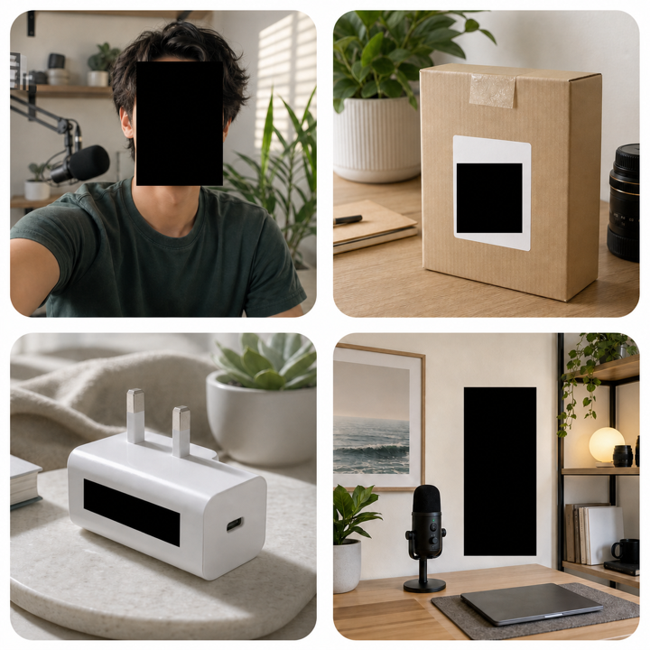
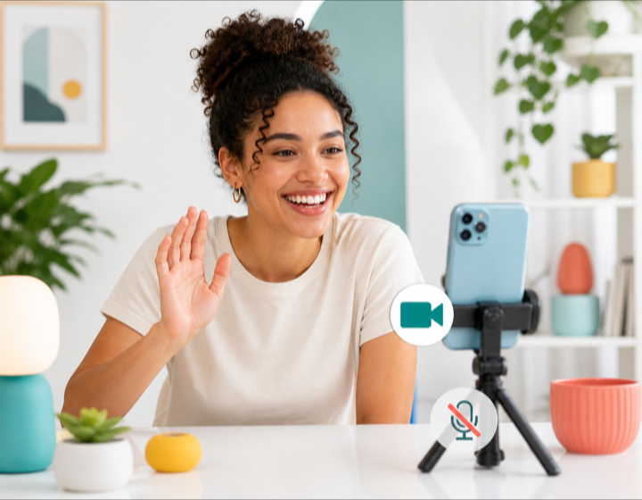
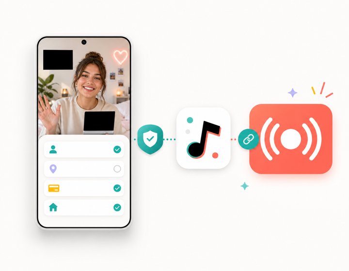

# LiveShield

LiveShield is a native Android privacy layer for creators who stream live video.

The app turns privacy into part of the camera workflow: it analyzes the scene on-device, lets the
creator choose what stays covered, renders a protected preview, and sends the sanitized video into
the live-streaming pipeline.

## The Problem

Live creators regularly stream from bedrooms, offices, studios, and public spaces where private
details can enter the frame without warning. Another person's face, a QR code, a name on a parcel, a
screen in the background, or part of the room may become visible while the creator is focused on the
audience.

Live video makes this especially difficult. There is no editing pass before each frame reaches the
viewer, and manually preparing every object and camera angle does not adapt when people or objects
move. Creators need privacy controls that work continuously inside the live camera workflow and show
the protected result before it is published.

## How LiveShield Solves It

LiveShield places a programmable privacy layer between the camera and the stream:

- **Understand the frame:** on-device vision finds faces, private words, QR codes, and barcodes.
- **Give the creator control:** the creator selects their face, adds private words, enables code
  protection, and draws fixed privacy zones directly on the preview.
- **Protect before publishing:** OpenGL renders the masks before the frame reaches the preview or
  video encoder.
- **Use one sanitized path:** the protected preview and H.264 stream come from the same rendered
  output, so the creator sees the version being prepared for publication.
- **Keep protection responsive:** frame freshness, tracking, scene state, queue state, and connection
  health continuously update the privacy decision.
- **Delay publication safely:** encoded video passes through a bounded two-second queue before it is
  sent to the configured RTMP destination.

## Project Summary

The LiveShield workflow has six main stages:

1. Capture the camera feed through CameraX and run face, text, and QR/barcode analysis on-device.
2. Combine detected content with the creator's selected face, private words, and drawn privacy zones.
3. Produce one privacy decision for each frame using freshness, tracking, scene, and health state.
4. Render the decision through OpenGL so the preview and encoder receive protected pixels.
5. Encode the sanitized output as H.264 and hold it in a bounded two-second safety queue.
6. Publish the protected video to the creator's configured RTMP destination.

The core pipeline is:

```text
camera frame -> on-device analysis -> privacy decision -> protected render
             -> sanitized preview + H.264 encode -> delayed queue -> RTMP
```

## Product Visuals

LiveShield gives creators one place to configure the privacy tools used by the protected preview.



The product is designed around a video-first creator workflow with on-device visual protection.



Once the preview is ready, the same sanitized output continues into the live publication path.



## Privacy Controls

| Control | What it does |
|---|---|
| Face selection | Lets the creator choose which detected face may remain visible |
| Face masks | Covers other detected faces and lets the creator remove masks by tapping them |
| QR and barcode protection | Detects supported codes and covers them in the preview |
| Private words | Covers session-specific words or phrases entered by the creator |
| Privacy zones | Lets the creator draw fixed covered areas directly on the preview |
| Destination setup | Configures the RTMP destination used by the protected live session |

## Architecture

LiveShield uses a sanitized-first pipeline. Camera frames enter the analysis and rendering boundary,
while downstream preview, encoding, queueing, and transport operate on protected output.

```text
CameraX
   |
   +---- ImageAnalysis ----> face | text | QR/barcode ----+
   |                                                       |
   +---- SurfaceProcessor input ----> privacy policy ------+
                                                           v
                                                   OpenGL renderer
                                                           |
                                      +--------------------+-------------------+
                                      |                                        |
                              Sanitized preview                        H.264 encoder
                                                                               |
                                                                   two-second queue
                                                                               |
                                                                      RTMP publisher
```

| Module | Responsibility |
|---|---|
| `privacy-domain` | Privacy policy, freshness rules, host continuity, zones, and session state |
| `vision` | Offline face detection, private-word recognition, and QR/barcode analysis |
| `video-pipeline` | Camera graph, frame scheduling, OpenGL protection, preview, and H.264 encoding |
| `transport` | Sanitized video boundary, delayed queue, RTMP publication, and connection health |
| `app` | Onboarding, protected setup, destination flow, session coordination, and live status |
| `benchmark` | Android macrobenchmark entry points |
| `test-fixtures` | Deterministic media, annotations, manifests, validators, and evaluation utilities |

## Technology

- Java 17
- Android SDK Platform 37, target SDK 36, minimum SDK 24
- CameraX and OpenGL ES
- OpenCV YuNet
- PaddleOCR and ONNX Runtime
- ZXing
- MediaCodec H.264
- RootEncoder RTMP
- MediaMTX
- JUnit, AndroidX Test, Espresso, Checkstyle, and Android Lint

## Project Files

- `app/` — Android application, creator setup flow, and live session coordination.
- `privacy-domain/` — Pure Java privacy decisions and state.
- `vision/` — On-device face, text, and code analysis.
- `video-pipeline/` — Sanitized camera preview and video encoding.
- `transport/` — Delayed protected-video publication.
- `test-fixtures/` — Repeatable media generation and evaluation tools.
- `specs/001-live-privacy-protection/` — Product architecture and pipeline contracts.
- `docs/PORTFOLIO_CASE_STUDY.md` — Engineering case study.

## How To Run

Requirements:

- Android Studio with JDK 17
- Android SDK Platform 37 and platform-tools
- An ARM64 Android device or emulator running API 24 or newer

Build the debug APK:

```bash
./gradlew :app:assembleDebug
```

Install it on a connected device:

```bash
./gradlew :app:installDebug
```

Run the host checks:

```bash
./gradlew test lint checkstyleAll checkPrivacyBoundaries
python3 -m unittest discover tools/testdata/tests
```

Start the local RTMP environment:

```bash
docker compose -f dev/mediamtx/compose.yml up
```
